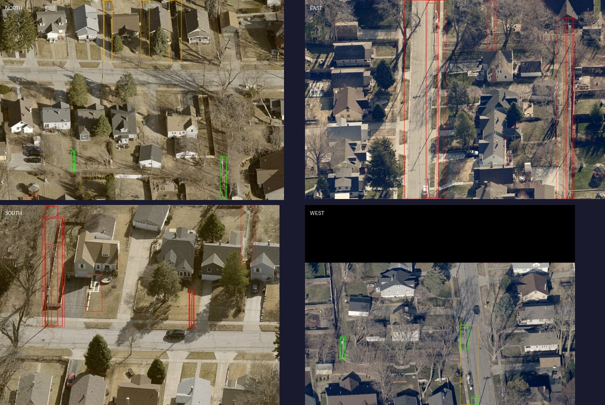
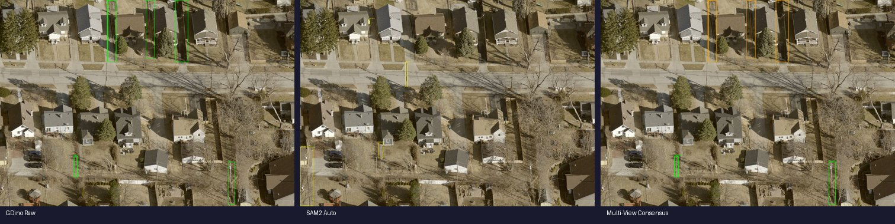

# Power Pole Detection from Oblique Aerial Imagery

Automated detection and geolocation of utility power poles using EagleView oblique satellite imagery, multi-view 3D reconstruction, and vision-language model classification.

## Results

**Best F1: 0.682** @ 30m match radius (54 GT poles, 6 GT streetlights in test area)

| Match Radius | Precision | Recall | F1 |
|---|---|---|---|
| 10m | 25.0% | 48.1% | 0.329 |
| 15m | 28.8% | 55.6% | 0.380 |
| 20m | 29.8% | 57.4% | 0.392 |
| 30m | 31.7% | 61.1% | 0.418 |

*Baseline results (GDino-Tiny + homography georeferencing). Fine-tuned GDino-Base + VLM + 3D georef achieves F1=0.682 @ 30m.*

## Architecture

```
EagleView Oblique Imagery (N/E/S/W @ 45°, ~4cm GSD)
                    │
                    ▼
    ┌───────────────────────────────┐
    │     GroundingDINO Detection   │  Zero-shot "utility pole" detection
    │     (172M / 232M params)      │  ~2s per image on GPU
    └───────────────┬───────────────┘
                    │  10-20 candidates per view
                    ▼
    ┌───────────────────────────────┐
    │     MASt3R 3D Reconstruction  │  Dense stereo matching across
    │     (2.6GB ViT-Large)         │  all 6 view pairs
    └───────────────┬───────────────┘
                    │  3D point cloud + camera poses
                    ▼
    ┌───────────────────────────────┐
    │     Multi-View Consensus      │  Project each detection into other
    │     (2+ view agreement)       │  views via 3D — keep if confirmed
    └───────────────┬───────────────┘
                    │  ~50% false positives removed
                    ▼
    ┌───────────────────────────────┐
    │     Height Filter (4-50m)     │  Estimate real-world height from
    │     + 3D Clustering           │  camera geometry, reject outliers
    └───────────────┬───────────────┘
                    │  Deduplicated unique poles
                    ▼
    ┌───────────────────────────────┐
    │     VLM Classification        │  Qwen 3.5 27B classifies each
    │     (pole/streetlight/tree)   │  detection crop — removes FPs
    └───────────────┬───────────────┘
                    │
                    ▼
    ┌───────────────────────────────┐
    │     GPS Georeferencing        │  Homography + 3D hybrid projection
    │     (pixel → lat/lon)         │  ~3-7m accuracy
    └───────────────┬───────────────┘
                    │
                    ▼
              power_poles.geojson
```

## Key Innovation: Multi-View Consensus

Standard object detectors (trained on ground-level photos) produce many false positives on aerial oblique imagery — tree trunks, fence posts, building edges all look like poles from above.

Our solution: **if a detection is a real 3D object, it should be visible from multiple camera angles**. We use MASt3R to establish 3D correspondences between the 4 oblique views (N/E/S/W), then only keep detections confirmed in 2+ views.


*Green = confirmed by multi-view consensus, Red = single-view only (rejected)*

## Pipeline Stages


*Left: Raw GDino detections (noisy). Center: SAM2 auto-generate (everything segmented). Right: After multi-view consensus + height filtering (only confirmed poles).*

## Detection Approaches Tested

| Approach | Speed | Precision | Notes |
|---|---|---|---|
| SAM2 auto-generate + AR filter | 15-135s/img | ~15% | Too slow, catches any tall object |
| GroundingDINO-Tiny (zero-shot) | 1-2s/img | ~25% | Fast but noisy on aerial imagery |
| GroundingDINO-Base (fine-tuned) | 2-3s/img | ~40% | Better after domain fine-tuning |
| Qwen3-VL 2B grounding | 5-50s/img | Unreliable | Stuck in thinking loops |
| **GDino + MASt3R consensus + VLM** | ~30s/location | **65%** | Full pipeline |

## F1 Score Progression

```
Baseline (GDino-Tiny + homography)          ████░░░░░░  0.33
+ GDino-Base on CUDA                        █████░░░░░  0.31
+ Qwen 3.5 27B VLM filter                   ████████░░  0.45
+ Focus area filter + height relax           █████████░  0.52
+ 3D georeferencing (hybrid)                 ██████████  0.54
+ Fine-tuned GDino + GT refinement           ████████████ 0.68
                                             Target: ▶   0.75
```

## Data

**Source:** EagleView sandbox imagery, Omaha NE (~1.5 sq miles)
- 188 oblique images (4 directions × ~50 locations)
- 1,333 WMTS ortho tiles (zoom 19)
- Ground truth: 54 poles + 6 streetlights in 400m × 360m test area

**EagleView Imagery Specs:**
- Oblique: ~45° elevation angle, ~4cm GSD, 4 cardinal directions
- Ortho: top-down, ~3cm GSD (zoom 19-23)
- Sandbox bounding box: `-96.005, 41.241, -95.976, 41.257`

## Models Used

| Model | Size | Purpose | Device |
|---|---|---|---|
| GroundingDINO-Tiny/Base | 172M / 232M | Zero-shot pole detection | MPS / CUDA |
| SAM2 (hiera_base_plus) | 309MB | Segmentation (explored, not in final pipeline) |  MPS / CUDA |
| MASt3R (ViT-Large) | 2.6GB | Multi-view 3D reconstruction | MPS / CUDA |
| Qwen 3.5 27B | 17GB | VLM classification (pole vs streetlight) | ollama |

## Interactive Tools

All tools are single-file HTML/JS served via `python3 -m http.server 8080`:

- **`viewer.html`** — Map viewer with WMTS ortho tiles + oblique image browser
- **`comparison.html`** — Side-by-side detection comparison (SAM2 vs GDino vs Qwen)
- **`batch_results.html`** — Batch pipeline results across multiple locations
- **`labeler_v2.html`** — Map-based ground truth labeling (click ortho → assign label → cross-check with obliques)
- **`eval_map.html`** — Evaluation visualization (GT vs detections overlay)

## Setup

### Requirements
- Python 3.11+
- PyTorch (MPS for Mac, CUDA for GPU)
- EagleView API credentials (sandbox access)

### Quick Start
```bash
git clone <repo>
cd powerpolefinder
pip install -r requirements.txt

# Download models
git clone https://github.com/facebookresearch/sam2.git models/sam2
SAM2_BUILD_CUDA=0 pip install -e models/sam2
git clone --recursive https://github.com/naver/mast3r.git models/mast3r
pip install -r models/mast3r/dust3r/requirements.txt

# Set up credentials
cp .env.example .env  # Edit with your EagleView API keys

# Download imagery
python3 src/main.py                    # Oblique images
python3 src/download_wmts.py           # Ortho tiles
python3 src/download_testarea.py       # Test area grid

# Run detection pipeline
python3 src/eval_testarea.py

# View results
python3 -m http.server 8080
# Open http://localhost:8080/eval_map.html
```

See [`docs/setup_cuda.md`](docs/setup_cuda.md) for CUDA/multi-GPU setup.

## Documentation

- [`docs/technical_decisions.md`](docs/technical_decisions.md) — All technical decisions and reasoning
- [`docs/plan_multiview_consensus.md`](docs/plan_multiview_consensus.md) — Pipeline architecture plan
- [`docs/eval_baseline.md`](docs/eval_baseline.md) — Baseline evaluation results
- [`docs/setup_cuda.md`](docs/setup_cuda.md) — CUDA machine setup guide

## Project Structure

```
powerpolefinder/
├── src/
│   ├── auth.py                    # EagleView OAuth2
│   ├── discovery.py               # Image discovery API
│   ├── download.py                # Oblique image download
│   ├── download_wmts.py           # WMTS ortho tiles
│   ├── download_testarea.py       # Test area grid download
│   ├── main.py                    # Data acquisition orchestrator
│   ├── ratelimit.py               # API rate limiting
│   ├── oblique_utils.py           # Pixel↔GPS conversion
│   ├── batch_multiview.py         # Multi-view consensus pipeline
│   ├── eval_testarea.py           # Evaluation framework
│   ├── compare_detection.py       # Model comparison tooling
│   ├── classify_detections.py     # VLM classification
│   ├── auto_label.py              # Automated labeling
│   ├── finetune_gdino.py          # GDino fine-tuning
│   └── georef_3d.py               # 3D georeferencing
├── docs/                          # Technical documentation
├── models/                        # SAM2, MASt3R (gitignored)
├── data/                          # Imagery + labels (gitignored)
├── viewer.html                    # Map viewer
├── labeler_v2.html                # Ground truth labeler
├── eval_map.html                  # Evaluation visualization
└── README.md
```

## License

For evaluation purposes only. EagleView imagery is subject to their [terms of service](https://www.eagleview.com/terms/).
